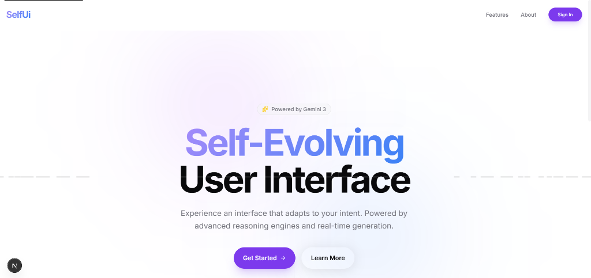
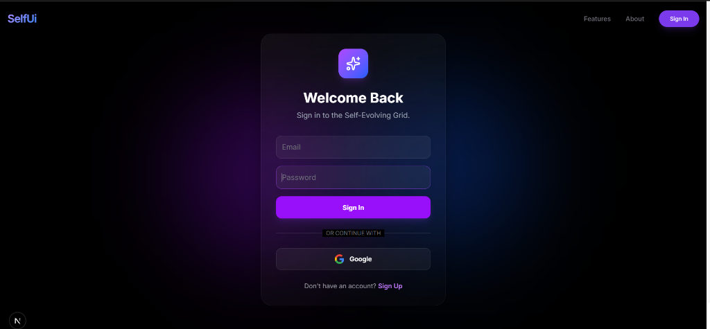

# SelfUi

SelfUi is a generative UI development platform that acts as a self-evolving canvas. It allows developers to describe interfaces in plain English and instantly receive production-ready code (HTML/Tailwind or React/JSX).

<p align="center">
  
</p>

## ⚡ Powered by Gemini 2.0 Flash

<div align="center">
  
  <br/>
  <i>Engineered for Speed & Precision</i>
</div>

---

## 🛠️ Tech Stack

Designed with the bleeding edge of web technology.

<p align="center">
  
  
  
  
  
  
</p>

## ✨ Features

- **🎨 Generative Canvas**: Powered by Google's **Gemini 1.5 Flash**, generating clean, responsive, and modern UI components in seconds.
- **🔄 Dual Export Engine**: Switch instantly between raw **HTML** and **React (JSX)** output. The code is optimized for Tailwind CSS.
- **💾 Semantic History**: Automatically saves your generations locally. Revisit, refine, or fork previous ideas without losing context.
- **✨ Active Formatting**: Auto-corrects common syntax issues (like `class` vs `className`) when switching views.
- **📱 Responsive by Default**: Fully responsive interface with a collapsible, gesture-friendly sidebar for mobile workflows.

<p align="center">
  
</p>

## 🚀 Getting Started

### Prerequisites

- Node.js 18+
- A Google Gemini API Key

### Installation

1.  **Clone the repository**
    ```bash
    git clone https://github.com/yourusername/selfui.git
    cd selfui
    ```

2.  **Install dependencies**
    ```bash
    npm install
    ```

3.  **Environment Setup**
    Create a `.env.local` file in the root directory:
    ```env
    NEXT_PUBLIC_GEMINI_API_KEY=your_api_key_here
    ```

4.  **Run the development server**
    ```bash
    npm run dev
    ```

Open [http://localhost:3000](http://localhost:3000) to start building.

## License

MIT
